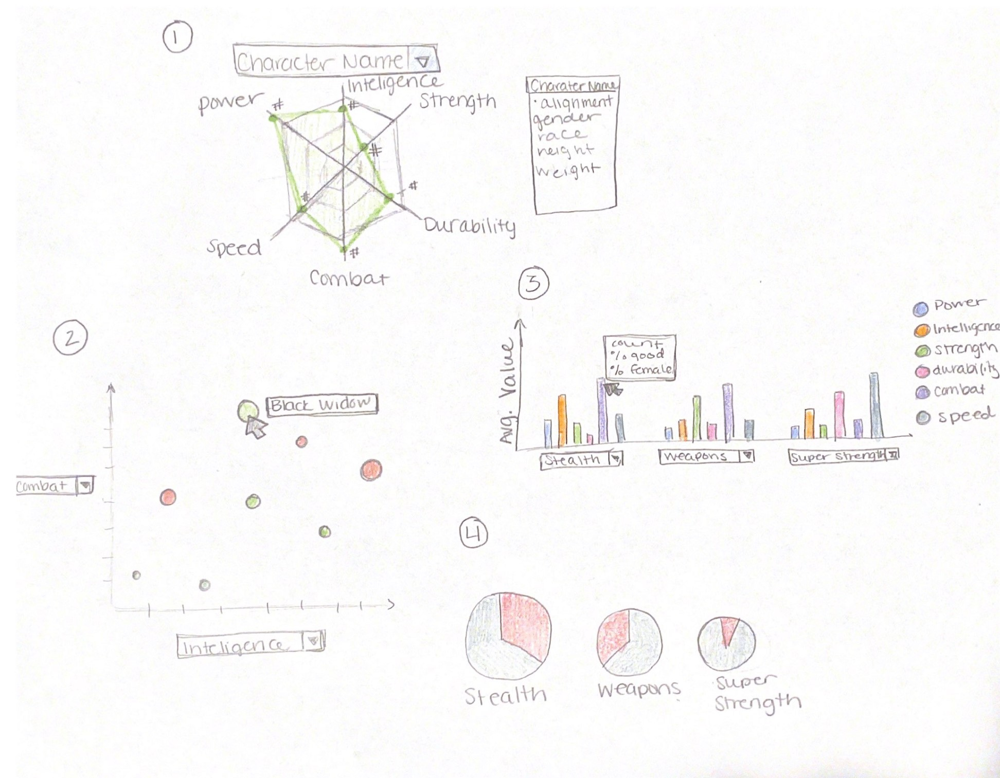

## Data Visualization Final Project

As some one who got obsessed with Marvel during the pandemic (like "create an excel spreadsheet of each movie with its rating" level obsessed), I knew that the project for data visulization had to be something that I could obsess over. So naturally I choose Marvel.

### Data

I was able to find a pretty extensive dataset on Kaggle that detailed information about all the characters from the comic books. For each character it contains information such as gender, race, skin color, eye color, and alignment. There are numeric based power measurements (such as strength, inteligence, or speed) that cumulate into a total score. There is also many specific super powers (stealth, weapons master, or super strength) that are in a binary format for each character.

For data cleaning, luckily only a few modificiations were needed. First, some gender information was blank, so were filled after a few google searches and the Marvel Wiki page. Second, any characters that did not contain data for each of the numeric based power measurements were filtered out as there was no realiable way to fill in that information. For each of the specific super powers, a columns was created for a list of each characters powers. Lastly, each character was given their rank based on their total score. 

<a href="https://gist.github.com/LeahMitchell/8ad46fbcac8d7420bcd5b97b1a245f43"> GistHub Link </a>

### Sketches
Below is an example of my personal favorite 4 sketches from the brainstorming assignment, sketched out in a little more detail/color. There are many more visualizations that I would want to create and would love to have a a full page of Marvel vis for fans to geek out over. The end goal would to have all graphs on a github website and strung together to create a narative about Marvel. 

1. This graph is a spider graph to help detail the relationship between numerical power values for a character. The coloring of the graph would be based on the alignment and there would be a info box to the side to help detail a little more about the character. A more advanced goal of this graph would be the ability to layer multiple characters on the same graph or have multiple spider graphs in the same window. 
2. This graph is a interactive scatterplot where users can change the x and y axis to be the various numerical power values. The points would be colored by alignment and character name would appear. (See prototypes)
3. This bar graph would detail the average numerical power values for each categorical power. So, the average values for all characters with a power, such as stealth, would be displayed. There would be around 3 total categorical powers displayed on one plot with drop down menus to choose which powers the user wants to display. Another advanced goal would to have other stats displayed when hovering over the bars. 
4. Lastly, this graph is an example of a more static graph. These pie (or donut) charts would show the proportion of good vs bad character that have a specific categorical power. The size of the pie chart would be based on the total number of characters that have that power. This graph could also benefit from interation 

### Questions & Tasks

At the beginning of the project, we were asked to ask questions we hoped to answer through the developement of our visualizations. Below were the main questions that I set out to answer with my visualizations. 

 * What numeric or categorical strength is more prevelant across the characters? 
 * Who are the strongest characters (by total numeric strength/powers or by total categorical powers or by both) overall and what is their alignment? 
 * What are some of the general trends across the genders, powers, race against general count of characters per alignment?
 * For each character, what is a general make up of their abilities? 

Some other questions that I was still interested in answering included:

* Following up on strongest, what are some of the patterns or characteristics of the strongest or weakest characters?
* Do certain numerical power scores correlate to specific categorical powers?
* What are the various patterns in gender, numeric and categorical powers for teams (i.e. original avengers), partners (i.e. Falcon and Winter Solider), and enemies (i.e. Ironman and Thanos)

Looking back now at the end of the project, I think I would have benefited more from picking on or two main questions to base my work off of, rather than a whole long list that left the options a little too broad. 

### Prototypes

Throughout this semester, I worked on and developed a few different prototypes that are worth mentioning. Two of these prototypes ended up playing integral roles in the final visualization. 

The most flushed out design is a scatterplot of the numeric power values, sized by the total power value. This visualization also allows the user the capabilities to highlight points to determine the character's name and the ability to choose the X and Y axis values. Most recently, a voroni graph was added to the scatterplot to make highlight character names easier and the ability to choose a character to highlight was added. Future iterations of this graph would add in the ability to zoom in on the points and the ability to highlight points under a specific alignment.

<a href="https://vizhub.com/LeahMitchell/b2ef2f5b5aaf4e888fabfd979b4a7b80?edit=files&file=index.js"> VizHub Link </a>

Another visualization that was developed more radar graph that will show the relationship of a charaters numeric power values. The radar chart allows users to pick which character they are interested in seeing and the color changes based on character alignment along with the total power value at the bottom. 

<a href="https://vizhub.com/LeahMitchell/12732aef9fd54f20ab0e9d080c6cca46"> VizHub Link </a>

The last prototype is a very simple bar chart of the number of characters for each alignment. Future iterations of this work will include more specifics into the makeup of each bar, for example the gender or race breakdown of each bar. This chart is the least prioritized due to the reinvisioned final product described below. 

<a href="https://vizhub.com/LeahMitchell/8b04fa1b1f9d467d9c79152421120b17"> VizHub Link </a>

### Reinvisioning the Final Product

Towards the end of the semester, I met with Professor Kelleher to discuss the status of my project. After some brainstorming, we decided that my final project will be a two sided visualization with a scatterplot on the left and a radar chart on the right. The scatterplot will be much like the one previously discussed with better tooltip interactions and the radar chart will also be like the one currently developed with the ability to choose which character. At this time we had discussed that the two interactions would be linked so as a user "finds" a character on the scatterplot, the radar chart will update to show the corresponding radar chart. In reverse, as a character is chosen on the radar chart, the characters scatterplot value will be highlighted on the scatterplot.

We made this one visualization my priority and discussed other possible addition if time allows. 

### Final Result

The final result, shown below, is almost everything we pictured when reinvisioning the project. The only adjustment is that the scatterplot does not control the radar chart, as it would be too unstable for users to truly use. For example, a user could find a character on the scatterplot and while trying to navigate to the radar to explore it, the user would most likely change the character due to the Voroni graph. Some additions to the graphs include some more visability into the data, such as the summary statistics above the radar chart and the ability to compare two characters at once when wanted. 

<iframe width="560" height="292" src="https://vizhub.com/LeahMitchell/369be3627211463fba6b94f06f4c3ccc?mode=embed" title="Marvel Charts" frameborder="0" ></iframe>

The final visualization is quite complex and has a lot of interaction, both for the user and within the plot. For a full tour of the graph, see the video listed below!

### Conclusions

I am personally suprised at how much I was able to get done for this project, but I did start this semester with higher hopes for what I was going to be able to get done. I didn't understand in the beginning how much there was for me to learn, not just about putting together interesting and complete visualizations but learning how to code in javascript too. As someone with a "Python-brain", I often found myself struggling to comprehend the language of javascript itself. 

In all honesty, I don't think I've ever been as excited to show friends and family a class project. I often shared my different prototypes with classmates, friends, and my sister to get feedback and input on how to improve my project. I love Marvel and being able to work with a dataset that was so interesting and personal has made this project so more important to me. It gave me more of a sense of ownership knowing it was about something I loved. This is something I could see doing much more in the future and making it a hobby, but probably once I have more free time after graduate school. 

Overall, it's crazy to see how far I've come from my very first assignment -- another Marvel themed visualization. (Did I mention I like Marvel?)

<iframe width="400" height="208" src="https://vizhub.com/LeahMitchell/ba228697251846f2855769e57d86059c?mode=embed" title="SVG Fundamentals: Marvel Logo" frameborder="0" ></iframe>

